= Setup Windows Server 2016
Dr. Jim Marquardson, Northern Michigan University <jimarqua@nmu.edu>
v1.0, 2019-11-12

Windows Server is an operating system developed by Microsoft that is optimized for continuously running applications that serve data to clients.

== Prerequisites

* VirtualBox installed (VMWare desktop versions will work fine)

== Get Download and License Key

Windows Server can be expensive but Microsoft gives it to students for evaluation purposes. 

1. Go to dreamspark.com and login with a Microsoft account. You will need to associate your account with your student email. You must verify your email before downloading.
2. Locate Windows Server 2016 in the available software. As of writing this, the URL is https://catalog.imagine.microsoft.com/en-us/Catalog/Product/524, but Microsoft does not like stable URLs so that link will probably change.
3. Choose the Standard 64-bit version.
4. Click "Get Key." Copy this key into a text file and save it somehere you will remember.
5. Download the file. It's a big file and can take a while.

Important: Do **NOT** directly mount the downloaded .ISO file and run the installation. This will erase your entire computer.

== Installation in VirtualBox

In this section you will start the installation process.

1. Launch VirtualBox.
2. Click `New`.
+
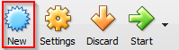
3. Name the virtual machine "Server 2016" and for the version select "Othe Windows (64-bit)." (If VirtualBox is updated and Server 2016 64-bit is an option, select it). Click next when done.
+
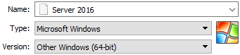
4. Increase the memory size to 2048 MB (2 gigabytes). Windows Server struggles mightily when it does not have enough memory.
+
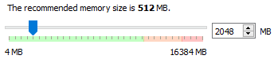
5. Leave the option to create a virtual hard disk now selected.
+
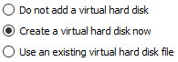
6. Leave the default VDI option selected.
+
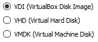
7. Leave the hard drive as dynamically allocated.
+
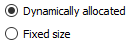
8. Leave the file location and size as recommended.
+
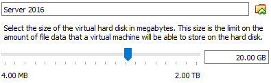
9. The server VM will now show up in VirtualBox. Right-click on your VM and choose "Settings..."
+
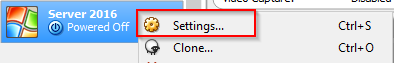
10. Click the storage tab, highlight the CD, click the disk icon, then choose "Choose Virtual Optical Disk File..."
+
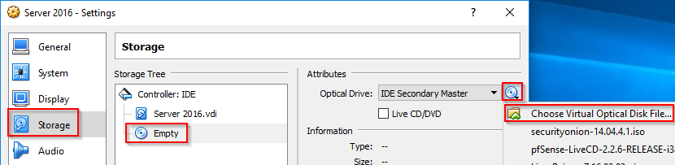
11. Locate the .ISO file you downloaded from Microsoft. It is probably in your downloads folder. Open the file then click OK.
+
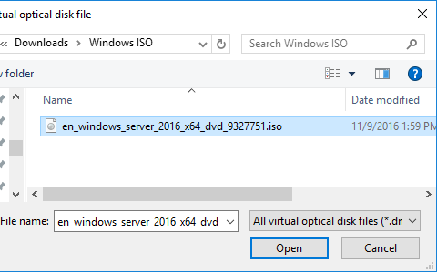
12. Highlight Server 2016 in VirtualBox, then click Start.
+
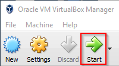

== Installing Windows Server 2016

1. When you boot your machine you should see the Windows logo. After a few moments, you will see the setup dialog box. Leave the defaults and click "Next."
+
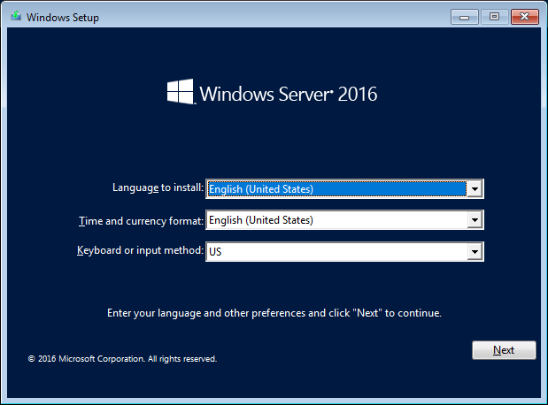
2. Click "Install now." The only other option on the screen is to repair your computer but since you have not installed anything there is nothing to repair.
+
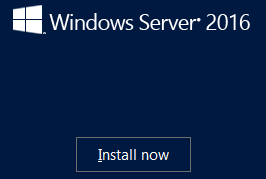
3. When prompted, type in your product key. Sadly, you cannot copy and paste. Windows will enter the dashes for you.
+
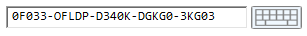
4. Choose the option with the "Desktop Experience." The desktop experience option gives you a graphical user interface (GUI) to manage the server. An experienced server admin might not need the GUI but it is helpful for learning the system.
+
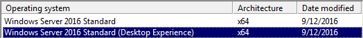
5. Fully read the license terms. Just kidding nobody does that. Accept the terms and click next.
6. Choose "Custom Install" because there is nothing to upgrade.
7. Choose to install Windows on Drive 0.
+
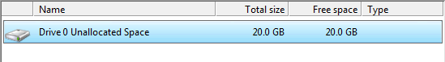
8. It will take 2-10 minutes to install all of the necessary files depending on your hardware. Windows will reboot automaticallypass.
+
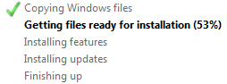
9. Choose a password you will remember. The password should contain an upper case letter and a symbol. The password "Password1" will work. You can configure the password complexity requirements later if you want.
+
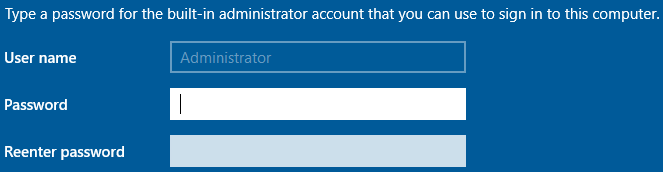
10. Finally you will be greeted with a windows desktop screen and be told to press Ctrl+Alt+Delete to unlock.
+
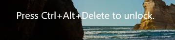
+
There are two ways to unlock the machine. First, you can go to the VirtualBox menu and choose Input > Insert Ctrl-Alt-Delete. Second, you can click inside the VM and press the right-control key and delete at the same time.
11. Enter your password.
+
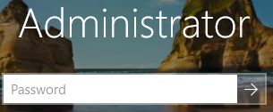
12. Select that you want the PC to be discoverable by devices on the network.
+
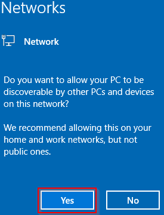
13. Windows will automatically show you the server dashboard with a quickstart guide to configuring the server.
+
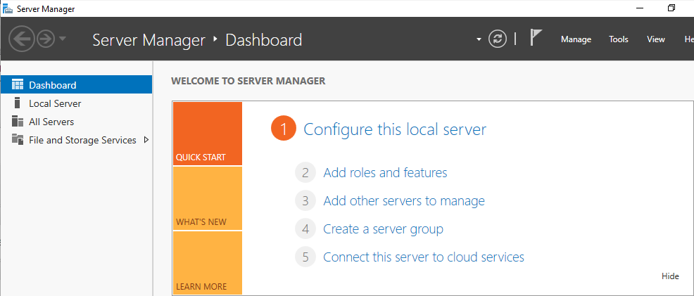
+
You can close the server manager application. It can always be started again later.

You now have a Windows Server 2016 operating system installed in VirtualBox.

== Challenge

* Explore the interface. How does the start menu differ from the client version of Windows?
* Close then start the server manager.
* What should you do first when setting up the server?
* What server roles are installed by default? (Meaning, what can the server already serve?)
* What is your server's IP address?
* How many network adapters does your computer have?
* Can you ping google.com?
