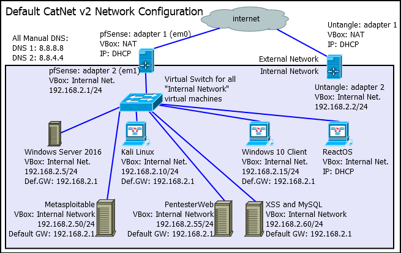

= CatNet Overview
Dr. Jim Marquardson, Northern Michigan University <jimarqua@nmu.edu>
v1.0, 2019-11-12

CatNet is a small network that mimics critical elements of a much larger business network. It has a mix of clients and servers that resemble devices found in real-world networks.

This document describes how CatNet was created and how it can be used to learn more about networking and network security.

== Network Layout

The following diagram shows the different computers that comprise CatNet.

All devices in the internal network should be able to communicate with each other directly. For example, the Kali Linux virtual machine can access websites served from the Metasploitable virtual machine. When using the pfSense virtual machine as the default gateway, all virtual machines on the internal network can access the internet.

== VirtualBox

There are many virtualization platforms. The most popular desktop virtualization platforms are VMWare Workstation and Oracle VirtualBox. VirtualBox was chosen for CatNet because its core is open source and it is available for Windows, Mac OSX, and Linux hosts.

To use CatNet, you should have the latest version of VirtualBox and its Extension packs. Both can be found here: https://www.virtualbox.org/wiki/Downloads

CatNet v2 was initially created using VirtualBox 5.2.18. Newer versions of VirtualBox should work fine. Older versions will not.

The VirtualBox extension packs should be installed. The extension packs makes things like window resizing and mouse integration work better. Download the extension packs from https://www.virtualbox.org/wiki/Downloads. Download the file in the extension pack section labelled "All Supported Platforms." The extension pack version should match your version of VirtualBox.

== Virtual Machines 

There are a mix of virtual machines and operating systems--Windows desktop, Windows server, several flavors of Linux, and FreeBSD. It is important to feel comfortable in all operating systems. Comfortable enough not to feel lost, at least.

The Windows Server 2016 operating system must be licensed. See the virtual machine's description in VirtualBox for product key information.

The Windows 10 client virtual machines provided by Microsoft expire periodically. A newer version may need to be downloaded from the following website: https://developer.microsoft.com/en-us/windows/downloads/virtual-machines.

See the appendix for the process used to for the original installation of several of the key virtual machines.

The virtual machines described here are distributed to students at Northerm Michigan University (NMU) via USB hard drives. But, you can create the environment manually if you are not a student of NMU. Certain places in this document will refer to the USB hard drive. If you have installed the virtual machines in another location, adjust the instructions accordingly.

== Network Settings

A virtual machine (VM) can connect directly to the internet by sharing the hosts internet connection. This mode (NAT) is the default networking mode. One downside to NAT networking is that VM-to-VM networking does not work. Because both VM-to-VM and VM-to-internet networking is often required in CatNet, a routing VM with two network adapters (pfSense) has been created. The pfSense VM has two network adapters. The WAN (wide area network) adapter is setup as NAT to allow it to route traffic to the internet. The LAN (local area network) adapter is set to Internal Networking so that it can communicate with other virtual machines. In VirtualBox, all virtual machines with network adapters set to Internal Networking will be able to communicate.

The following table shows the baseline network configuration of the virtual machines. In some labs, changes may need to be made to these settings.

|=====================================================================================
|Virtual Machine     | VirtualBox Adapter | OS IP Address   | Method to Set IP Address
|Windows Server 2016 | Internal Network   | 192.168.2.5/24  | Control Panel GUI
|Kali                | Internal Network   | 192.168.2.10/24 | GUI (disable and enable)
|Windows 10 Client   | Internal Network   | 192.168.2.15/24 | GUI
|ReactOS             | Internal Network   | DHCP            | N/A
|Metasploitable      | Internal Network   | 192.168.2.50/24 | terminal
|PentesterWeb        | Internal Network   | 192.168.2.55/24 | terminal
|XSS and MYSQL       | Internal Network   | 192.168.2.60/24 | terminal
|pfSense Adapter 1   | NAT                | Auto (DHCP)     | Shell wizard/GUI
|pfSense Adapter 2   | Internal Network   | 192.168.2.1/24  | Shell wizard/GUI
|Ungangle Adapter 1  | NAT                | Auto (DHCP)     | GUI
|Ungangle Adapter 2  | Internal Network   | 192.168.2.2/24  | GUI
|=====================================================================================

For DNS, use 8.8.8.8 and 8.8.4.4 for DNS servers when specifying manual IP address settings.

IMPORTANT: If any VM needs access to the internet, the pfSense virtual machine must be running.

== Acceptable Use

These VMs belong to you. You can use them however you see fit. You can try to hack your self, corrupt your data, change configurations, etc. You should *not* use these VMs to attempt to scan, access, alter, or manipulate systems for which you are not explicitly authorized. To properly learn how to safeguard systems from attackers, you must understand how attackers operate and the tools they will use against you. But you must use these tools appropriately and never attempt any sort of malicious activity using these skills.

include::../standard_license.adoc[]