= VirtualBox Introduction
Dr. Jim Marquardson, Northern Michigan University <jimarqua@nmu.edu>
v1.0, 2019-11-12

Your computer has an operating system (OS), probably Windows, Mac OS, or a version of Linux. Software exists that allows you to run another OS while your main OS is still running. For example, with a Windows laptop, you could run Ubuntu Linux as if it were another application on your computer. Your Windows OS would be the "host," and the Ubuntu Linux OS would be the "guest." In this case, the guest is not connecting to your hardware directly, but virtually, and is therefore called a virtual machine. Virtual machines run on virtualization software that makes the system hardware and host platform agnostic.

There are several software platforms that allow you to run virtual machines. At the enterprise level, Microsoft's Hyper-V and VMWare ESX allow professionals to deploy virtual machines inside data centers. With these platforms, there is no host OS; the virtual machines run on the server hardware with on a thin virtualization layer between the operating system and the hardware. Virtualization is quickly become the de-facto option for deploying servers in an enterprise environment.

Virtualization options exist for desktop users who want to run guest operating systems. The guest operating systems can be used for software development, testing software exploits, or learning about different operating systems. By default, the guest operating system cannot affect the host operating system. Guest operating systems can be configured to interact with the host operating system by sharing write access to specific folders, but a guest operating system will never make configuration changes to the host operating system. Basically, you can run guest operating systems without worrying about messing up your computer.

== Learning Objectives

By the end of this exercise you should be able to:

* Define a virtual machine
* Describe the difference between a host computer and a guest computer
* Install VirtualBox
* Install the VirtualBox Extension Pack
* Access the BIOS
* Enable virtualization features in the BIOS
* Register already created virtual machines in VirtualBox
* Boot virtual machines
* Access the internet from a virtual machine
* Veryify connectivity from Linux with ping
* Stop virtual machines

== Prerequisites

* A computer (Windows, Mac OSX, or Linux operating system) where you can install software.

== Download and Install VirtualBox

Oracle VirtualBox is a an excellent open source tool for running virtual machines on your system. It has an added advantage in that it is free. We will use VirtualBox for all of the labs in this course to demonstrate and try out networking concepts. 

* Open https://www.virtualbox.org/wiki/Downloads
* Download the latest version of VirtualBox for Windows hosts (or your computer's primary operating system if it is not Windows)
* Install VirtualBox when the download completes
* Go back to https://www.virtualbox.org/wiki/Downloads and download the VirtualBox extensions for "all platforms." Once downloaded, double-click this file to install the extensions in VirtualBox.

== Launch VirtualBox

* Launch VirtualBox
+

* The first time you use VirtualBox, you will probably not see any virtual machines. In the screenshot below, several virtual machines have been created.
+
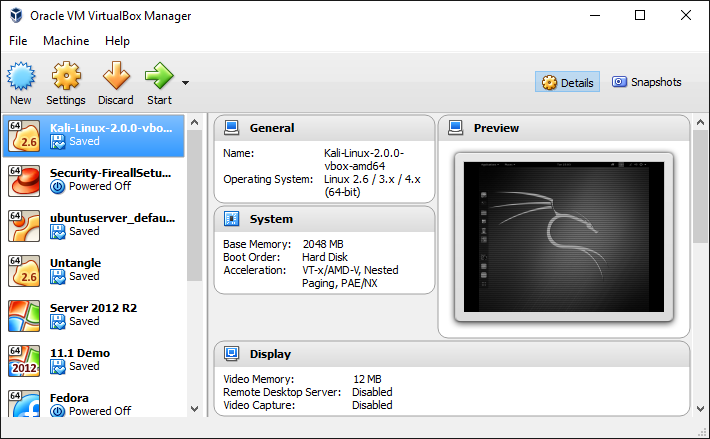

== Verify Operating System Support

* In VirtualBox, click `New` to start the virtual machine creation process.
+
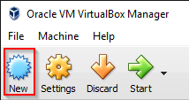
* Click the `Version` drop-down to see what operating system versions are available. If you see 32 and 64 bit operating system versions (as shown in the following screenshot), skip the Enable Virtualization section.
+
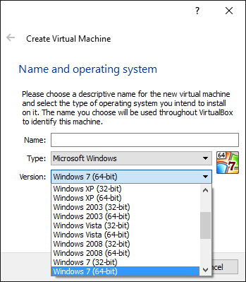

If you do NOT see 64 bit options available in VirtualBox, you need to configure your BIOS to enable virtualization features.

== Enable Virtualization in the BIOS

The BIOS controls whether or not your operating system can take advantage of certain hardware features. Some computers are configured to deny virtualization extensions, which prevents VirtualBox from running correctly. Take care when updating your BIOS. Only change settings if you understand the ramifications of the chagnes. Turning on virtualization in the BIOS is safe, but changing other settings (such as overclocking your RAM or CPU) can actually damage the hardware.

* First, you need to check your BIOS settings. You must restart your computer and (depending on your computer) press [enter], F1, F2, or the DELETE key to enter the BIOS configuration. Basically, you can just start hitting those keys as soon as your computer begins the boot process. If you see the Windows logo, you did not hit the keys soon enough, and if this happens just reboot and try again.
* On a Lenovo laptop, press `[enter]` immediately when the following screen appears.
+
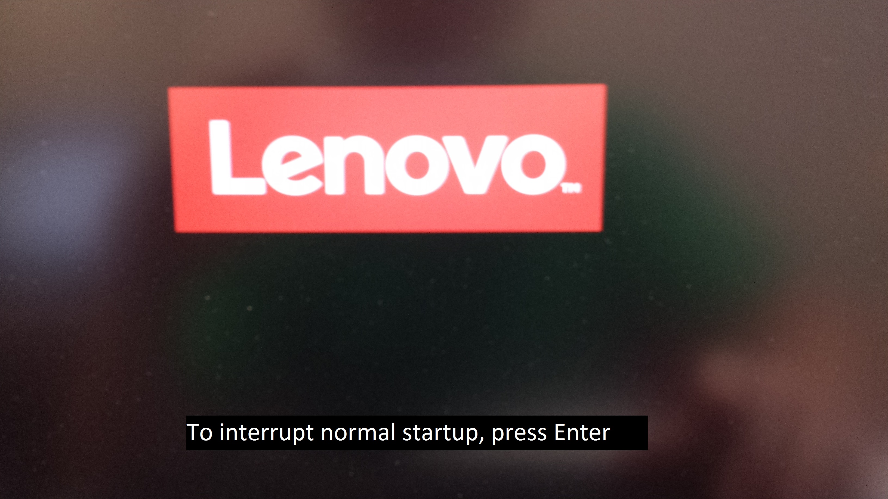
* On Lenovo laptops, press `F1` (without holding the "Fn" key) to enter the BIOS setup. If you do not press `F1` quickly enough your computer will automatically continue its normal boot process. If this happens, just reboot your computer and start over.
+
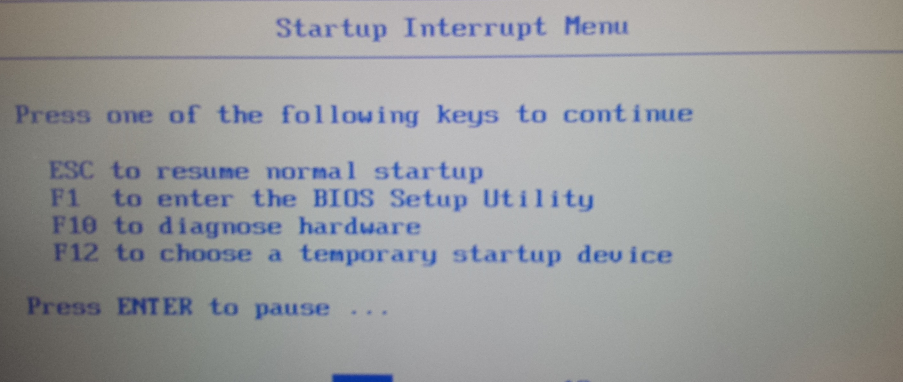
    * If you are having trouble getting into your BIOS, see this article: http://www.makeuseof.com/tag/enter-bios-computer/.
* In your BIOS, you will need to enable virtualization.
* For Lenovo laptops, go to the Security tab, highlight Virtualization and hit [enter].
+
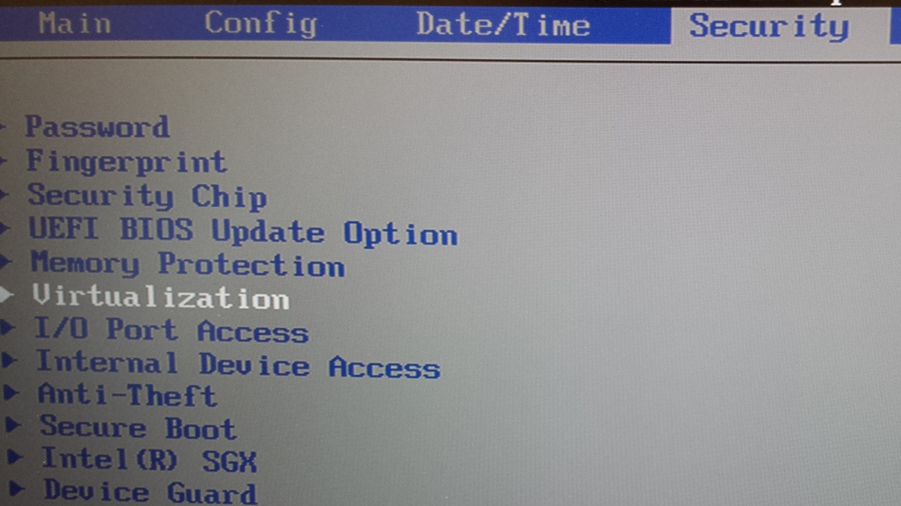
* Enable all virtualization options.
+
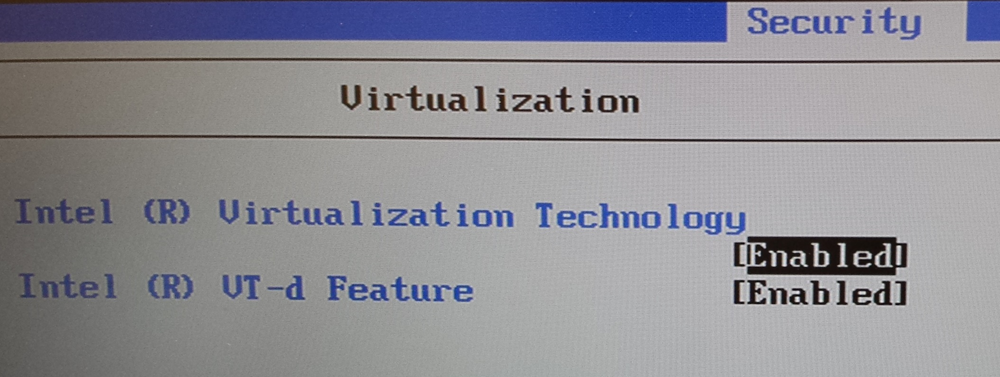
* Press `F10` to save and exit. Confirm that you want to make the changes when prompted.
+

+

* Boot your computer normally and login to Windows.
* Once your computer has booted, start VirtualBox and ensure that 64 bit operating systems are available.

== Loading CatNet VMs

This process will ensure that your VirtualBox setup is complete.

=== Registering CatNet VMs in VirtualBox

* Connect the USB hard drive to your computer.
* Open the hard drive and open the CatNet folder (with the version number).
* Each folder is a different VM.
* Open the pfSense folder. There will be several files.
** CatNet v2 pfSense.vbox. Double click this file to register this VM with VirtualBox.
** CatNet v2 pfSense.vbox-prev. This is a screenshot file automatically generated by VirtualBox. Leave it alone.
** CatNet v2 pfSense.vdi. This is the virtual hard drive that contains the entire VM.
+
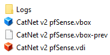
* In Windows, go back to the CatNet folder.
* Open the Kali folder.
* Double click the .vbox file to register the Kali Linux VM in VirtualBox.
* You should see the following virtual machines in the VirtualBox Manager.
+
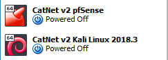


=== Launching CatNet VMs

* Open the VirtualBox Manager.
* Highlight the pfSense VM and click Start. Let pfSense boot without selecting any options.
* Highlight the Kali Linux VM and click Start. It should boot directly to a graphical user interface.
** Note than when Kali boots, it might pause for a long time when you see the following message:
+
kali-thin-script.png[]
+
If it hangs for a while, just hit [esacpe] then [enter] to force it to get on with it. 
* In the Kali VM, launch the terminal by clicking on the terminal icon on the left-hand menu.
+
image::terminal_icon.png[]
* Use the following command to test internet connectivity.
+
```
ping google.com
```
* The ping should be successful. Press control+c to stop the ping. In Windows, ping makes four connection attempts by default. In Linux, the default behavior is to ping until the user stops it.
+
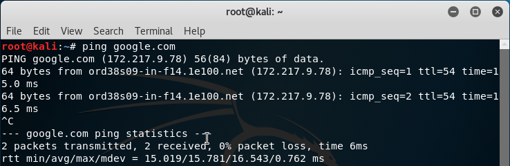

=== Cleaning Up

There are several ways to stop virtual machines. On the VM window, clicking the "X" at the top-right corner will bring up a menu with the three options.

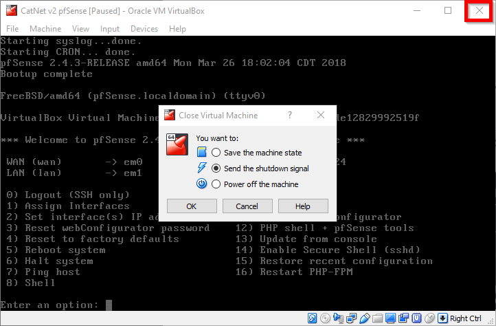

. Save the machine state. This is similar to putting a computer to sleep. VirtualBox takes a snapshot of the VM's memory and saves it to disk. When the machine is started again, the VM will wake up right where you last left off. This is generally the preferred method for stopping virtual machines. The only downside the extra disk space the snapshots use.
. Send the shutdown signal. This method attempts to ask the VM to shutdown nicely. It is similar to shutting down your own computer. This method allows the VM to shut down gracefully, save files, and do whatever else it needs as part of the shutdown process.
. Power off the machine. This method is equivalent to yanking the power cord on a desktop computer. It's fast, but should only be used for VMs running from a live CD or if the VM crashes for some reason.

Close the Kali and pfSense VMs by saving the machine state.

== Challenge Questions

Some of these questions may require additional research on your part.

* Why is virtualization helpful in learning about network security?
* How many virtual machines could you run on your computer?
* How many computing resources does a single virtual machine need?
* Can people on the internet access your virtual machine?
