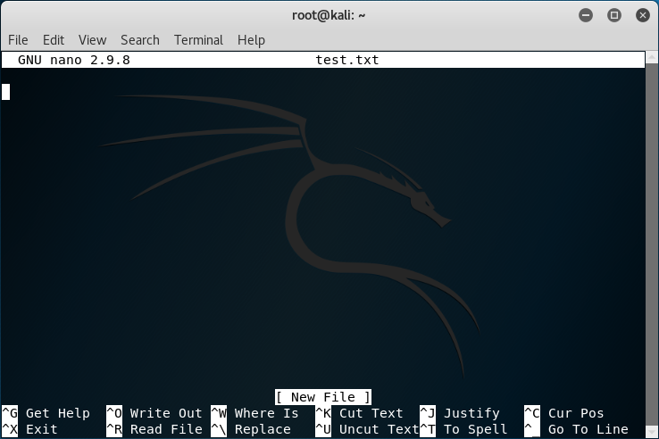
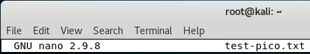
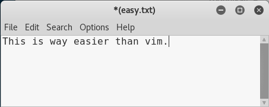

= Text Editors in Linux
Dr. Jim Marquardson, Northern Michigan University <jimarqua@nmu.edu>
v1.0, 2019-11-12

To become a competent security professional, you have to know Linux basics. One task you will do many times on many systems is editing text files. In the Windows world, Notepad is the bare bones way to edit text. Notepad is not powerful, but it is easy to use because it has a simply graphical user interface. You can discover every feature Notepad has to offer in about 5 minutes.

The original Linux text editors were built to run in the terminal. Without fancy toolbars or menus, the Linux text editors relied more on keyboard shortcuts than visual prompts. Though harder to use than Notepad, you can learn the basics of the most popular text editors in a few minutes.

`Vi` is a powerful text editor that exists on virtually every Linux distribution. `Vi` is extremely powerful but has a steep learning curve. `Nano` is less powerful but are easier to learn. Pico is the predecessor to nano. However, nano has replaced pico in most distributions. Running the `pico` command will usually launch nano. `Vim` is Vi Improved, and is what actually runs when you run `vi`. Generally, it does not matter if you tell people you run vi or vim, everbody who knows Linux will understand you.

`Leafpad` is a graphical text editor similar to Windows Notepad. It can be installed in most Linux distributions. It is available in Kali by default.

== Prerequisites

* Kali installed in VirtualBox

== Learning Objectives

By the end of this lesson, you should be able to:

. Use the nano text editor
. Switch between command mode (`[escape]`) and insert mode (`i`) in vi
. Save files in vi with `:w`
. Navigate vi using `h`, `j`, `k`, and `l` while in command mode.
. Quit vi with `:q`
. Use the Leafpad text editor
. Launch a text editor in Linux with root permission (e.g. `sudo nano`)
. Delete files with `rm`

== Nano

* Boot the Kali Linux VM in VirtualBox
* Open a terminal and run the following command:
+
```
nano test.txt
```
+

+
Notice the header and the footer.
+

+
The header tells you that nano is running and that you are editing the file test.txt. The footer tells you that this is a new file--it does not yet exist on the disk because you have not saved it. Keyboard commands are listed at the bottom of the page. The caret (`^`) represents the control key.

* Save the file by pressing control+o (i.e. ^O). You will be prompted for a file name which is prefilled with the file name you supplied earlier on the command line. Simply press enter to accept the default.
+

+
You will see a message that nano wrote zero lines because we have not added any text.
* Add a few lines of text and save the file again. This editor likely works the way you expect it to. You write some text, then issue a keyboard command to save the file. This is not very different from using Windows Notepad if you know the keyboard shortcuts.

* Exit from nano using the keyboard shortcut listed in the footer before continuing.

== Pico

* Run the following command simply to see what happens when you run `pico`.
+
```
pico test-pico.txt
```
+
Notice in the following screenshot that `nano` was actually launched.
+

* Exit from the editor

== Vi

There are many vi tutorials on the Internet. This guide will only give you the most basic instructions for surviving with vi. The most critical point to understand about vi is that there are two modes: 1) command mode, and 2) text insertion mode. By default, when vi opens you will be in command mode, meaning that if you just start typing your text you will not get what you expected.

* In the terminal, launch vi with the following command.
+
```
vi herewego.txt
```

* Type `help` to try to add some text.
** Notice that no text was inserted. Your computer may have beeped at you, and you got an error about nothing being in the register. 
** No text was added because you are in command mode.
* Type `i` to enter insert mode.
** Notice that the footer changes to show that you are in insert mode.
+

* Type `help` again. The text should appear as you expected it.
* To save the file, you have to enter command mode again.
* Press the `escape` key to enter command mode.
* There are many different commands that can be run in command mode. To save the file, type `:w` and press enter.
+

* In command mode, you can use the keys h, j, k, and l to move left, down, up, and right respectively. Add a few lines of text and practice using these keys. It is important to know how to navigate using these keys. There are times when the arrow keys may not be available to you.
* To quit, ensure that you are in command mode (by pressing escape), then type `:q` and press enter.

== Leafpad

* In the terminal, run the following command:
+
```
leafpad easy.txt
```
* Notice that a graphical program starts. Add some text and save the file using the menus.
+



So if Leafpad is the easiest of the three text editors, why don't we just use it all the time? A few reasons.

. Sometimes you will not have access to a graphic user interface. You have to use nano or vim.
. Vim is extremely powerful. If you learn to use it well, it could be one of the programs you rely on the most. It has a steep learning curve, however.

== Permissions

Kali let you run by the root (i.e. admin) user by default so you can make changes to any file. Other systems make you elevate privileges to change some files or settings. One example is making changes to the 'hosts' file.

* Run `vi /etc/hosts`
* Add a new line at the bottom of the file.
** Hint, the `o` command will insert a new line and enter insert mode.
* Try to save the file using `:w`. This command will work in Kali, but not places without root permissions.
* Make another change that you want to discard (i.e. just add some random text).
* Run `:q!` to quit without saving changes.
* Run `sudo vi /etc/hosts`
** This is the command needed to start vi with administrator privileges.
* Add a line at the bottom that says `127.0.0.1 timewaste.com`.
* Save the file and quit.
* Edit the file again and remove all of your changes.

By running `sudo vi` you started vi with elevated permissions. You could have run `sudo nano` to start nano with elevated permissions as well.

== Challenge

* From the linux command terminal, run `vimtutor`.
** Find 4 useful commands.
* Find a vim "cheat sheet" or start creating your own.

== Cleanup

* Delete any of the text files you created. You can use the `rm` command to remove (i.e. delete) files.
+
```
rm test.txt
rm herewego.txt
```
* Save the state of your Kali VM
